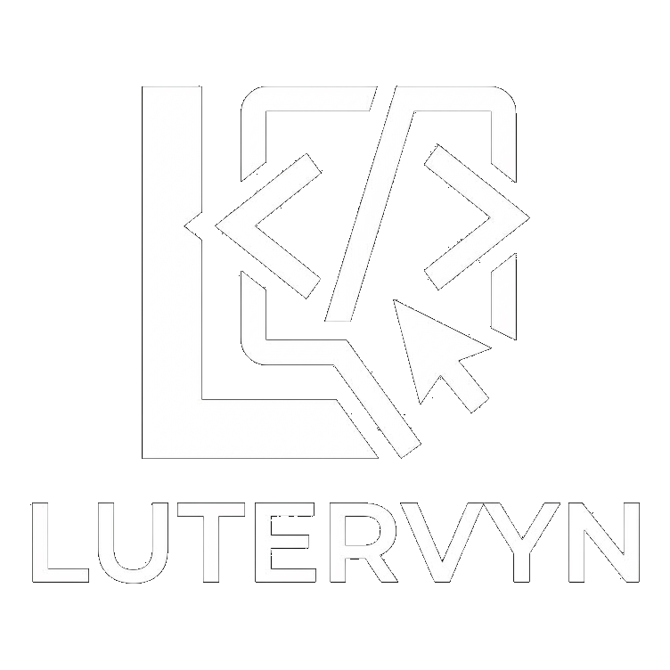
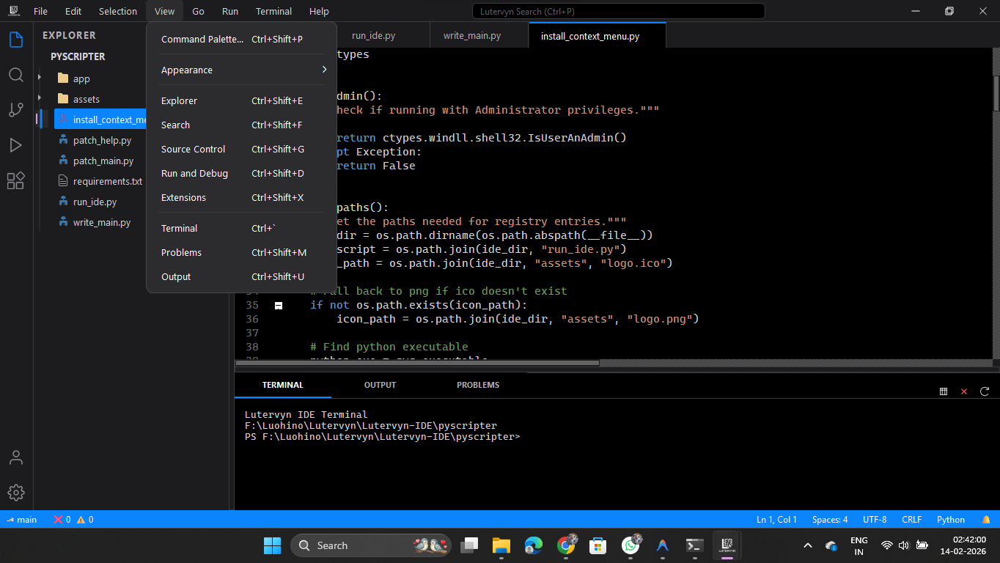
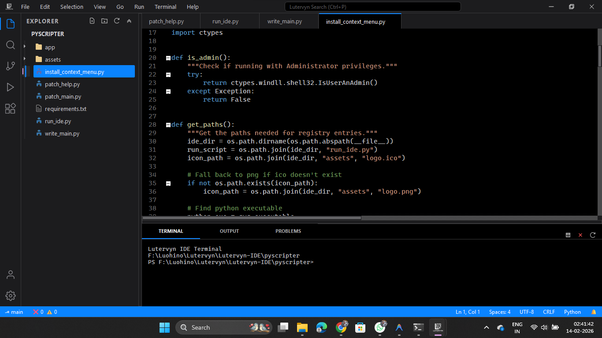
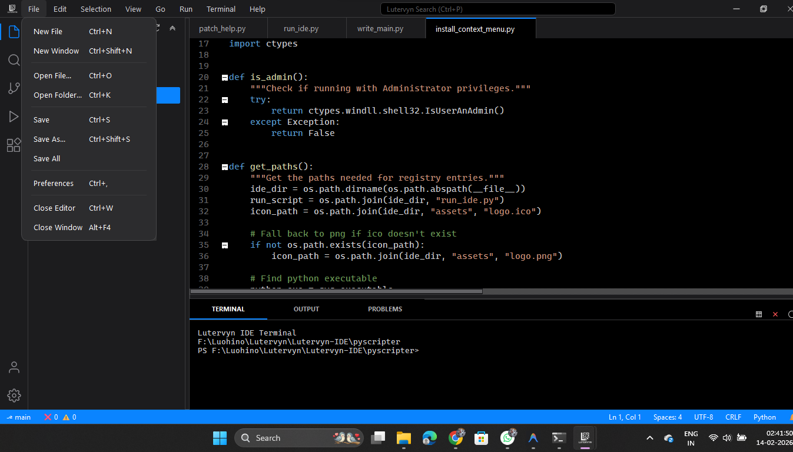
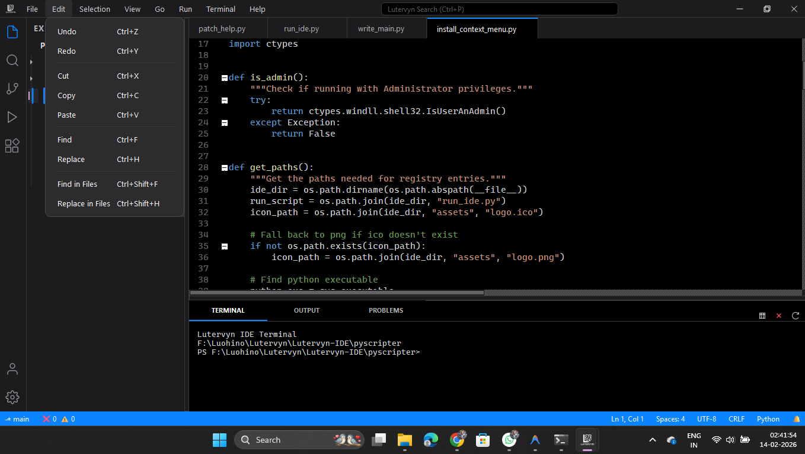

<div align="center">



# Lutervyn IDE

**A modern Python IDE built entirely in Python — inspired by VS Code.**


</div>

---

## ✨ Screenshots

<div align="center">

| | |
|:---:|:---:|
|  |  |
| **Overview — Full IDE Layout** | **Editor — Code Editing** |
|  |  |
| **Menus — VS Code-Style Dropdowns** | **Terminal — Integrated PowerShell** |

</div>

---

## 🚀 Features

### Editor
- 🖊️ **QScintilla-powered code editor** with syntax highlighting for Python, JavaScript, HTML, CSS, JSON, and more
- 📑 **Multi-tab editing** — open multiple files side by side
- 🔍 **Find & Replace** in the current file
- 🔢 **Line numbers**, current line highlight, auto-indentation

### Interface
- 🎨 **Custom frameless title bar** with integrated menus, search bar, and window controls — just like VS Code
- 🌗 **Dark & Light themes** — iOS-inspired modern design with rounded menus, pill scrollbars, and smooth styling
- 📂 **File Explorer sidebar** — browse and open files from any folder
- 🔎 **Search sidebar** — find text across your project
- 💻 **Integrated terminal** — embedded PowerShell right inside the IDE
- 📊 **Output & Problems panels** — view script output and errors
- ⌨️ **Command Palette** (`Ctrl+Shift+P`) — quick access to every command

### Python
- ▶️ **Run Python files** directly with one click or `F5`
- 🛑 **Stop running scripts** anytime
- 📤 **Output capture** — stdout and stderr shown in the Output panel

### Help & Tools
- 👋 **Welcome Page** — rich getting-started tab with quick links
- 📋 **Keyboard Shortcuts Reference** — searchable table of all shortcuts
- 📝 **Release Notes** viewer
- 🐛 **Report Issue** dialog — auto-collects system info
- 🔧 **Developer Tools** — log viewer with Python/system details

### OS Integration
- 📁 **Windows right-click context menu** — "Open with Lutervyn IDE" for files, folders, and folder backgrounds
- 🖼️ **Taskbar icon** — custom logo in taskbar and Alt+Tab

---

## 📦 Installation

### Prerequisites
- **Python 3.11+**
- **Windows 10/11**

### Setup

```bash
# Clone the repository
git clone https://github.com/Lutervyn/Lutervyn-IDE.git
cd Lutervyn-IDE/pyscripter

# Install dependencies
pip install PyQt6 PyQt6-QScintilla jedi chardet Pillow

# Run the IDE
python run_ide.py
```

### Optional: Add "Open with Lutervyn IDE" to Windows right-click menu

```bash
# Run as Administrator
python install_context_menu.py
```

---

## ⌨️ Keyboard Shortcuts

| Shortcut | Action |
|---|---|
| `Ctrl+N` | New File |
| `Ctrl+O` | Open File |
| `Ctrl+S` | Save |
| `Ctrl+Shift+S` | Save As |
| `Ctrl+Z` / `Ctrl+Y` | Undo / Redo |
| `Ctrl+X` / `Ctrl+C` / `Ctrl+V` | Cut / Copy / Paste |
| `Ctrl+F` | Find |
| `Ctrl+H` | Replace |
| `Ctrl+Shift+P` | Command Palette |
| `Ctrl+B` | Toggle Sidebar |
| `Ctrl+J` | Toggle Panel |
| `F5` | Run Python File |
| `Shift+F5` | Stop |
| `` Ctrl+` `` | Toggle Terminal |
| `Ctrl+Shift+E` | Explorer |
| `Ctrl+Shift+F` | Search |
| `Ctrl+K` | Keyboard Shortcuts |
| `Ctrl+Shift+I` | Developer Tools |

---

## 🏗️ Project Structure

```
Lutervyn-IDE/pyscripter/
├── run_ide.py                 # Entry point
├── install_context_menu.py    # Windows context menu installer
├── assets/
│   ├── logo.png               # IDE logo
│   └── logo.ico               # Icon for Windows
├── app/
│   ├── main_window.py         # Main window — menus, commands, layout
│   ├── core/
│   │   └── runner.py          # Python script runner (QProcess)
│   ├── ui/
│   │   ├── theme.py           # Dark/Light theme system & stylesheet
│   │   ├── titlebar.py        # Custom frameless title bar
│   │   ├── activity_bar.py    # Left icon bar (Explorer, Search, etc.)
│   │   ├── sidebar.py         # File explorer, search, SCM panels
│   │   ├── editor.py          # QScintilla editor + tab management
│   │   ├── panel.py           # Terminal, Output, Problems panels
│   │   ├── status_bar.py      # Bottom status bar
│   │   ├── command_palette.py # Ctrl+Shift+P command palette
│   │   └── help_dialogs.py    # Welcome, Shortcuts, Release Notes, etc.
│   └── widgets/
└── screenshots/
```

---

## 🛠️ Built With

- **[Python 3.11](https://python.org)** — Core language
- **[PyQt6](https://www.riverbankcomputing.com/software/pyqt/)** — GUI framework
- **[QScintilla](https://www.riverbankcomputing.com/software/qscintilla/)** — Code editor component
- **[Jedi](https://github.com/davidhalter/jedi)** — Python autocompletion engine

---

## 📄 License

This project is licensed under the **MIT License**.

---

<div align="center">
